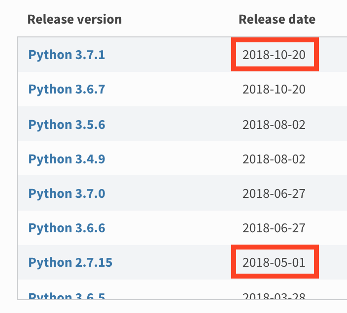

import { Appear } from "mdx-deck";
import { Split, SplitRight } from "mdx-deck/layouts";

import theme from "./theme";

export { theme };

import LinkCS from "./linkcs";

# Formation Dev Web

---

<LinkCS />

export default SplitRight;

## Rappels HTML

L'HTML n'est qu'une manière de représenter à l'écrit une page visuelle.

---

<LinkCS step={false} />

export default Split;

```HTML

<div>
  <button>Photo Perso</button>
  <button>Photo Cti</button>
</div>


<div>
  Date de naissance
  01/10/1996
</div>

<div>
  Surnoms
  Milka • Kangoo • Il suffit Jonathan • Massimo
</div>

<div>
  Plaque d'immatriculation
</div>

...
```

---

import Chrono from "./Chrono";

## Qu'est-ce que le JavaScript dans tout ça ?

<Appear>
  <div>
    <p style={{ fontSize: theme.fontSizes[2] }}>
      Le JavaScript est un langage de programmation qui est exécuté dans le navigateur et qui permet de rendre dynamique
      vos sites.
    </p>
  </div>
  <Chrono />
</Appear>

---

# The new f-strings in Python 3.6

<br />
<br />

## python pre 3.6

`"{}".format(a)`

## python 3.6+

`f"{a}"`

---

# Python 2 VS Python 3



---

# Ok, le python c'est bien beau mais c'est quoi le rapport avec le JavaScript ?

<Appear>
  <div>
    <h2 style={{ fontSize: theme.fontSizes[3], margin: "2em" }}>JavaScript n'est pas versionné</h2>
  </div>
  <div>
    <h2 style={{ fontSize: theme.fontSizes[3] }}>JavaScript n'a jamais de breaking changes</h2>
    <span>(ça c'est pour garantir qu'un site marchera toujours même 20 ans après)</span>
  </div>
</Appear>

---

# JavaScript n'est pas versionné

Les sites des années 7 doivent encore marcher maintenant.
