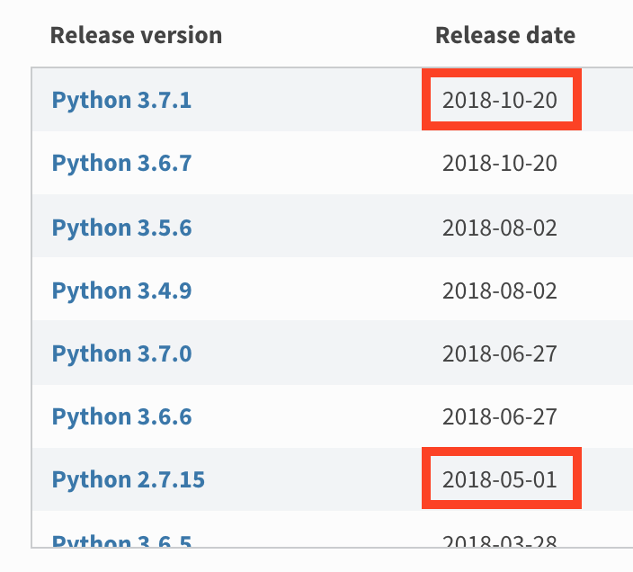

import { Appear } from "mdx-deck";
import { Split, SplitRight } from "mdx-deck/layouts";
import { CodeSurfer } from "mdx-deck-code-surfer";

import theme from "./theme";

export { theme };

import LinkCS from "./Linkcs";

# Formation Dev Web

---

# Rappels

## HTML CSS JS

---

<LinkCS />

export default SplitRight;

## Rappels HTML

L'HTML n'est qu'une manière de représenter à l'écrit une page visuelle.

---

<LinkCS step={false} />

export default Split;

```HTML

<div>
  <button>Photo Perso</button>
  <button>Photo Cti</button>
</div>


<div>
  Date de naissance
  01/10/1996
</div>

<div>
  Surnoms
  Milka • Kangoo • Il suffit Jonathan • Massimo
</div>

<div>
  Plaque d'immatriculation
</div>

...
```

---

import Chrono from "./Chrono";

## Qu'est-ce que le JavaScript dans tout ça ?

<Appear>
  <div>
    <p style={{ fontSize: theme.fontSizes[2] }}>
      Le JavaScript est un langage de programmation qui est exécuté dans le navigateur et qui permet de rendre dynamique
      vos sites.
    </p>
  </div>
  <Chrono />
</Appear>

---

# Versions

## et retrocompatibilité

---

# The new f-strings in Python 3.6

<br />
<br />

## python pre 3.6

`"{}".format(a)`

## python 3.6+

`f"{a}"`

---

# Gestion des versions de python



```notes
Les dates ne servent qu'à dire que python 2 c'est nul
```

---

# Ok, le python c'est bien beau mais c'est quoi le rapport avec le JavaScript ?

<Appear>
  <div>
    <h2 style={{ fontSize: theme.fontSizes[3], margin: "2em" }}>JavaScript n'est pas versionné</h2>
  </div>
  <div>
    <h2 style={{ fontSize: theme.fontSizes[3] }}>JavaScript n'a jamais de breaking changes</h2>
    <span>(ça c'est pour garantir qu'un site marchera toujours même 20 ans après)</span>
  </div>
</Appear>

---

# JavaScript n'est pas versionné

- À la place de faire des versions de JavaScript, des spéfications de fonctionnalités sont ajoutées,
- Ces fonctionnalités passent par plusieurs phases d'acceptation ([détails ici](https://tc39.github.io/process-document/)),
- Le commité [TC39](https://github.com/tc39/proposals) délibère chaque année sur toutes ces propositions,
- Les plateformes (navigateurs, NodeJS, etc.) implémentent les fonctionnalités qu'ils veulent en respectant (ou non) les specs.

(c'est aussi vrai pour le CSS)

```notes
HTML 5 et CSS 3

Pas de CSS 4

Parler de ES5-6-7-8
```

---

<div>
  <h1 style={{ fontSize: "10em" }}>
    <span style={{ fontSize: "2rem", lineHeight: "2rem" }}>Comment je sais ce que je peux utiliser ?</span>
    <br />
    😱
  </h1>
</div>

---

# Comment remédier à ça ?

Savoir quelles fonctionnalités on peut utiliser en fonction des cibles

[caniuse.com](https://caniuse.com/) (et [kangax](http://kangax.github.io/)) <br/>
(Pour la compatibilité)

---

# Comment remédier à ça ?

Créer des librairies qui permettent d'injecter des fonctionnalités non existantes (ou des les ajouter si elles n'existent pas) <br/>
`from __future__ import division`

Utiliser des [polyfills ou des ponyfills](https://kikobeats.com/polyfill-ponyfill-and-prollyfill/) <br/>
(Pour l'injection automatique de fonctionnalités)

```notes
Démo de division dans python 2 et 3
```

---

# Comment remédier à ça ?

Transpiler son code pour le rendre compatible <br/>
`f"Bonjour {name}"` -> `"Bonjour{name}".format(name=name)`

- [Babel](https://babeljs.io/) <br/>
  (Pour transpiler du code "récent" en code "vieux")
- Pour certaines features, on ne peut rien faire (ex : Symbol)

```notes
Petite démo Babel
```

---

# On ne devait pas parler de React ?

---

<CodeSurfer
  title=" "
  code={require("!!raw-loader!./static/html/first-app.html").trim()}
  lang="html"
  showNumbers
  steps={[
    { notes: "Ceci est un code valable et marche directement dans votre navigateur préféré" },
    { range: [5, 6], notes: "Injection de React" },
    { lines: [7], notes: "Load babel pour <script type='text/babel'>" },
    { lines: [10, 38], notes: "Balise qui sera écrasée lorsque React sera loadé" },
    { lines: [12, 39], notes: "Block de code transpilé par Babel puis exécuté par le navigateur" },
    { lines: [20], range: [13, 16], notes: "On définit un composant React" },
    { range: [26, 33], notes: "La méthode render correspond à ce que le composant va afficher" },
    {
      tokens: { 29: [5, 6, 7, 8, 9, 10, 11, 12, 13, 14, 15, 16, 17] },
      range: [22, 24],
      notes: "Lorsqu'on vient changer le contenu de l'input, la fonction handleChange est appelée"
    },
    {
      ranges: [[22, 24], [17, 19]],
      notes: "lorsque setState est appelé, this.state (initialisé au constructor) est modifié"
    },
    {
      tokens: { 29: [18, 19, 20, 21, 22, 23, 24, 25, 26, 27] },
      lines: [26, 30],
      notes: "La méthode render est appelée de nouveau et la valeur du state est injecté dans l'HTML"
    }
  ]}
/>

---

# Résultat

<iframe
  style={{ border: "none" }}
  src={`data:text/html;charset=utf-8,${require("!!raw-loader!./static/html/first-app.html")}`}
/>

---

# React vs React-DOM

**React** = Gestion du virtual DOM

**React-DOM** = Reconciler pour le DOM, c.à.d bindings entre le VDOM et le vrai DOM

**React-Native** = Reconciler pour Android / iOS, c.à.d bindings entre le VDOM et des composants natifs Android ou iOS


---

# Comment définir un composant React

Avec une classe

```jsx
class MyComponent extends React.Component {
  render() {
    return <div>Ceci est le minimum requis pour créer un composant</div>;
  }
}
```

Avec une fonction

```jsx
function MyComponent(props) {
  return <div>Ceci est le minimum requis pour créer un composant</div>;
}
```

Avec une fonction fléchée

```jsx
const MyComponent = props => <div>Ceci est le minimum requis pour créer un composant</div>;
```

---

## Depuis React 16.8, il n'y a plus aucune différence en terme de possibilités entre un composant classe et un composant fonction.

[Équivalence entre hooks and lifecycle](https://twitter.com/prchdk/status/1056960391543062528?s=09)

---

<CodeSurfer
  title="Okay, on va dire que je te suis. Mais c'est quoi ces < > dans ton render ?"
  code={require("!!raw-loader!./static/html/first-app.html")
    .split("\n")
    .filter((_, i) => i >= 25 && i < 33)
    .join("\n")}
/>

---

# JSX

Ce n'est pas de l'html, c'est du JSX

```jsx
const App = (
  <Element prop1={value1} props2={value2}>
    <Child1 />
    <Child2 />
  </Element>
);
```

Sucre syntaxique pour (converti par Babel) :

```jsx
const App = React.createElement(
  Element,
  { prop1: value1, props2: value2 },
  React.createElement(Child1, null),
  React.createElement(Child2, null)
);
```

Notes : il faut que React soit importé pour que le composant fonctionne car Babel réécrit votre fichier avec `React.createElement`

---

# Règles éléments React

Tout élément a une racine unique, si jamais vous voulez afficher plusieurs éléments JSX sans parent, utilisez `<React.Fragment>`

Don't

```jsx
const App = (
  <h1>title</h1>
  <h2>sub title</h2>
);
```

Do

```jsx
const App = (
  <React.Fragment>
    <h1>title</h1>
    <h2>sub title</h2>
  </React.Fragment>
);
```

---

# Règles éléments React

On utilise `{espression js}` pour injecter du code JS

Vous pouvez injecter des variables :

```jsx
const name = "World";

const App = <label>{name}</label>;
```

Ou n'importe quelle expression valide en JS :

```jsx
const condition = Math.random() > 0.5;

const App = <p style={{ visibility: condition ? "visible" : "hidden" }}>You {condition ? "can" : "can't"} see me</p>;
```

---

# Règles éléments React

Si vous voulez afficher une liste d'éléments JSX, il faut que vous leur donniez un attribut `key` qui permet de les traquer

```jsx
const characters = [
  {
    id: 0,
    name: "Tintin"
  },
  {
    id: 1,
    name: "Capitaine Haddock"
  },
  {
    id: 2,
    name: "Professeur Tournesol"
  },
  {
    id: 3,
    name: "Dupont"
  },
  {
    id: 4,
    name: "Dupond"
  }
];

const listOfCharacters = characters.map(character => <li key={character.id}>{character.name}</li>);

const App = <ul>{listOfCharacters}</ul>;
```

---

# Règles éléments React

- Si un composant retourne `null`, il n'affichera rien
- Les props et state d'un composant se doivent d'être pures (c.à.d non modifié)
- React fait la différence entre un élément HTML et un élément React grâce à la casse :

```jsx
const Li = ({ children, title }) => (
  <li className="list" title={title}>
    {children}
  </li>
);

// Jamais appelé
const ul = ({ children }) => <ul class="list-warpper">{children}</ul>;

const App = () => (
  <div>
    {/* div HTML */}
    <ul>
      {/* ul HTML */}
      <Li title="a">A</Li> {/* Li défini au dessus */}
      <Li title="b">B</Li>
    </ul>
  </div>
);
```

---

# Immutabilité

❗️Les state et props sont immutables ❗️

```jsx
this.state.list.push(element); // Don't ❌
this.setState(({ list }) => ({ list: list.push(element) })); // Don't ❌
this.setState(({ list }) => ({ list: [...list, element] })); // Do ✅
```

Pourquoi ?

- React ne détecte pas de changement donc ne va pas se re-render
- S'il se rerender quand même, on a changé la précédente valeur des props ou du state et donc on ne peut plus les comparer proprement
- La mutation peut se faire écraser par un setState prochain

En général en React, tout est immutable (sauf les attributs customs).

---

# Classes

---

<CodeSurfer
  title="Il est possible de de rajouter des méthodes qui vont être exécutées à des moments différents"
  code={require("!raw-loader!./static/js/SimpleComponent.js")
    .split("\n")
    .filter((_, i) => i > 1 && i <= 33)
    .join("\n")}
  steps={[
    {},
    { range: [2, 8], notes: "constructor est appelée lorsque le composant est crée" },
    { range: [22, 31], notes: "Puis render est appelée pour créer ce qui va être affiché" },
    {
      range: [10, 12],
      notes: "componentDidMount est appelée une fois que le composant a été monté dans le DOM (avec le visuel chargé)"
    },
    {
      range: [22, 31],
      notes: "render est ré-appelé à chaque fois que le composant doit subir un update"
    },
    {
      range: [14, 16],
      notes: "et après chaque update puis chaque mise-à-jour du DOM, componentDidUpdate est appelée"
    },
    {
      range: [18, 20],
      notes:
        "Losque composant va être retiré du DOM complètement, componentWillUnmount est appelé (utile pour supprimer des listeners)"
    }
  ]}
  showNumbers
/>

---

import LifeCycle from "./LifeCycle";

# Différentes méthodes disponibles

[Documentation complète](https://reactjs.org/docs/react-component.html)

<div style={{ display: "flex", flexDirection: "row" }}>
  <LifeCycle style={{ maxHeight: "80vh", height: "100%", flex: 2 }} />
  <div style={{ flex: 1, marginTop: "5em", fontSize: theme.fontSizes[2] }}>
    <p>
      Toutes les méthodes avec <b>UNSAFE</b> ne devraient plus être utilisées car vont être supprimées avec React 17.
    </p>
    <br />
    <p>
      Toutes les méthodes avec <b>STATIC</b> sont des méthodes de classe et pas d'instance.
    </p>
  </div>
</div>

---

# Hooks

---

<CodeSurfer
  title="Il est possible de de rajouter des méthodes qui vont être exécutées à des moments différents"
  code={require("!raw-loader!./static/js/SimpleHook.js")
    .split("\n")
    .filter((_, i) => i > 1 && i <= 24)
    .join("\n")}
  steps={[
    { notes: "Tout le corps de la fonction sauf ce qui est dans useEffect va être appelé" },
    {
      ranges: [[4, 5], [9, 9]],
      notes: "ce premier useEffect est appelé (équivalent à did mount)"
    },
    {
      range: [11, 13],
      notes: "puis ce deuxième useEffect est appelé (aussi un did mount)"
    },
    {
      notes: "et après chaque update toute la fonction sauf ce qui est dans useEffect va être reappelée"
    },
    {
      range: [11, 13],
      notes: "puis le deuxième useEffect est appelé (équivelent did update)"
    },
    {
      range: [6, 8],
      notes: "enfin, le callback du premier useEffect est appelé (équivalent will unmount)"
    }
  ]}
  showNumbers
/>

---

# Difference hooks vs component

[Documentation complète](https://reactjs.org/docs/hooks-overview.html)

Règles des hooks :

- L'ordre d'appel des hooks ont une importance
- Ne pas définir un hook dans un if
- Tous les hooks doivent commencés par "use" (même les hooks customs)

Bénéfices des hooks :

- À la place d'avoir un state "global" par composant, il faut définir un `useState` par variable de state
- useEffect permet d'avoir un contrôle plus précis du cycle de vie du composant en incluant au sein d'une même fonction les équivalents de `componentDidMount`, `componentDidUpdate`, `componentWillUnmount`, `shouldComponentUpdate` et `componentWillUpdate`
- Meilleure ségmentation de la logique pour les events listeners

Défaults :

- Nouvelle logique => développeurs moins habitués => moins lisible
- Donne facilement du code moins lisible

---

<CodeSurfer
  title="Passer des paramètres à des composants"
  code={require("!raw-loader!./static/js/Logic.js").trim()}
  showNumbers
/>

---

# Manipuler le DOM

[Documentation sur les refs](https://reactjs.org/docs/refs-and-the-dom.html)

En react, pour avoir accès au DOM, on utilise les `ref`.

---

<CodeSurfer title="Manipuler le DOM" code={require("!raw-loader!./static/js/Ref.js").trim()} />

---

# Bundles

---

Depuis le début, on fait tourner notre code dans 1 seul fichier HTML et dans une balise `<script type="text/babel">`, mais comment fait-on pour écrire son code dans plusieurs fichiers différents ?

- [Webpack](https://webpack.js.org/)
- [Parce](https://parceljs.org/)
- [Rollup](https://rollupjs.org/)

Tous ces outils vont prendre tout le code écrit et le réunifier en 1 gros fichier (ou plusieurs plus petits en fonction de leur confs).

---

# Et si on a la flemme de réécrire les mêmes lignes de conf pour tous nos projets ?

- [create-react-app](https://facebook.github.io/create-react-app/) : Paramètres assez complets pour gérer une **single-page application** en React
- [Next](https://nextjs.org/) : **Server-side rendering** très simple en React
- [Gatsby](https://www.gatsbyjs.org/) : Gestion de **sites statiques** en React avec prérendu des pages en fichiers HTML statiques + hydratation

---

import ToDo from "./ToDo";

# TP

Écrire avec [create-react-app](https://facebook.github.io/create-react-app/) une To-Do list

<ToDo />
